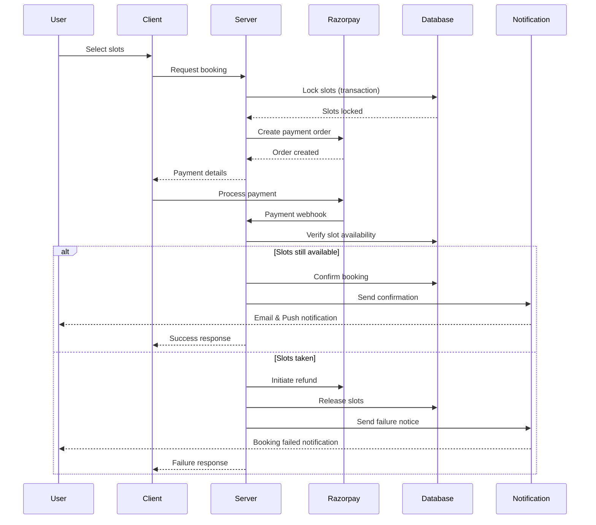
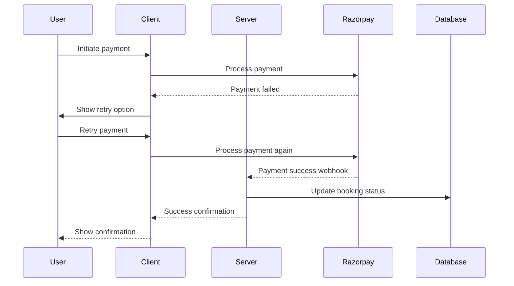
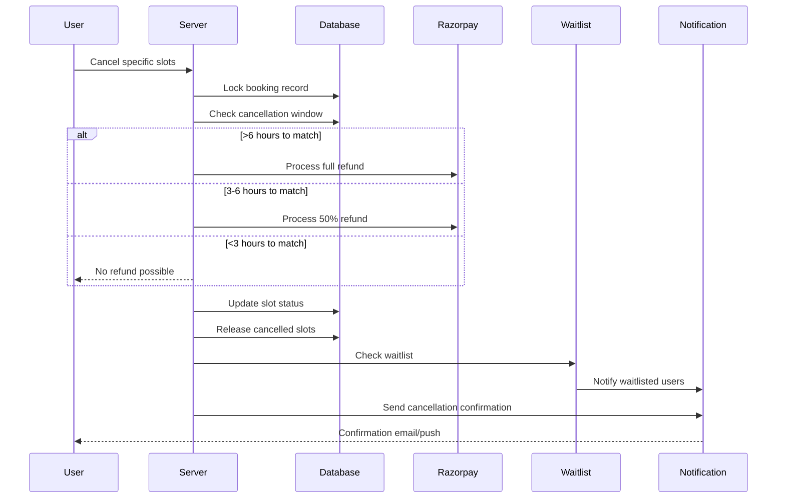
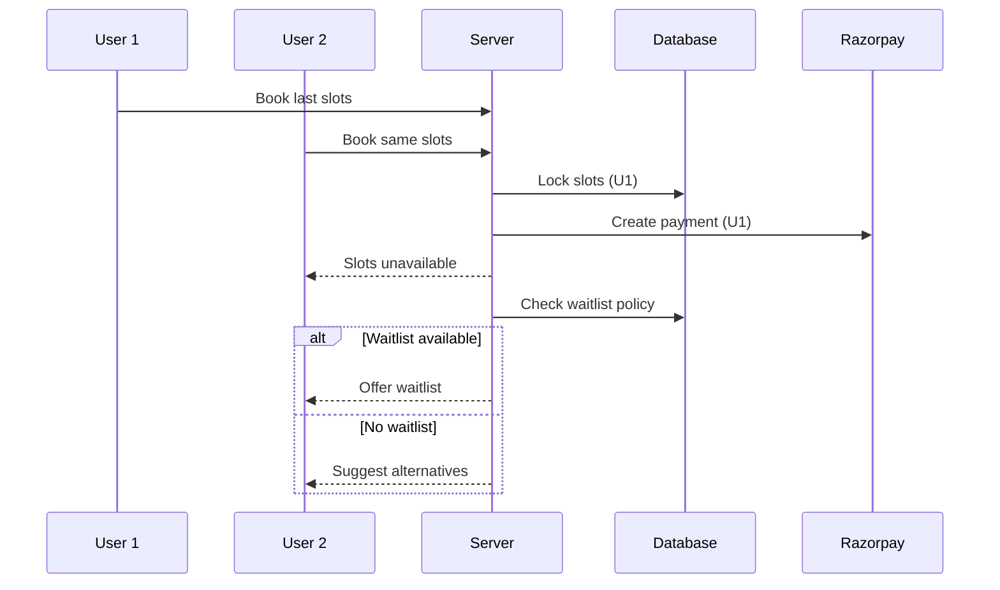
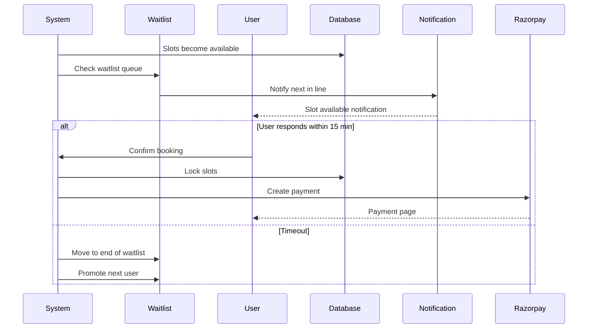

# Booking System Scenarios Documentation

## Table of Contents
1. [Booking Success Scenarios](#booking-success-scenarios)
2. [Booking Failure Scenarios](#booking-failure-scenarios)
3. [Cancellation Scenarios](#cancellation-scenarios)
4. [Edge Cases and Special Scenarios](#edge-cases-and-special-scenarios)
5. [System Responses](#system-responses)
6. [Database States](#database-states)
7. [Critical Implementation Requirements](#critical-implementation-requirements)
8. [Sequence Diagrams](#sequence-diagrams)

## Sequence Diagrams

### 1. Successful Booking Flow

### 2. Payment Failure and Retry Flow

### 3. Partial Cancellation Flow

### 4. Concurrent Booking Resolution Flow

### 5. Waitlist Promotion Flow

[Previous content remains the same...]