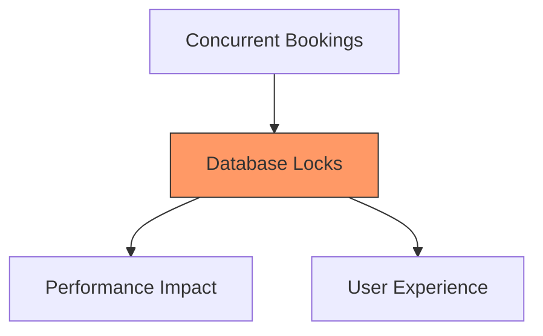
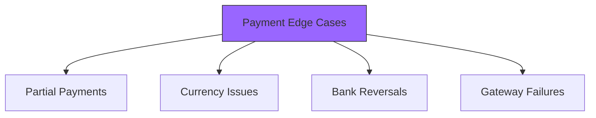

# Booking System Additional Considerations

## Performance Bottlenecks

### 1. Database Contention


**Solutions:**
- Implement optimistic locking where possible
- Use Redis for temporary slot locking
- Implement row-level locking instead of table locks
- Cache frequently accessed data
- Use connection pooling effectively

### 2. Webhook Processing
**Challenges:**
- Multiple simultaneous webhooks
- Processing order importance
- Webhook retry mechanism
- Webhook timeout handling

**Solutions:**
- Implement webhook queueing system
- Use worker pools for processing
- Implement idempotency checks
- Set up proper monitoring

### 3. Notification System
**Bottlenecks:**
- Mass notifications during popular matches
- Email service rate limits
- Push notification service limits
- SMS gateway limitations

**Solutions:**
- Implement notification queuing
- Batch similar notifications
- Use multiple notification providers
- Implement fallback mechanisms

## Missing Edge Cases

### 1. Payment Scenarios


**Handling Requirements:**
1. **Partial Payments:**
   - Track multiple payment attempts
   - Handle split payments
   - Manage payment reconciliation
   - Handle timeout scenarios

2. **Currency Management:**
   ```typescript
   interface CurrencyHandler {
     convertAmount(amount: number, fromCurrency: string, toCurrency: string): Promise<number>;
     handleRateFluctuation(bookingId: string, expectedRate: number, actualRate: number): Promise<void>;
     validateCurrencySupport(currency: string): boolean;
   }
   ```

3. **Payment Reversals:**
   ```typescript
   interface ReversalHandler {
     handleBankReversal(paymentId: string): Promise<void>;
     updateBookingStatus(bookingId: string, reversalAmount: number): Promise<void>;
     notifyUserOfReversal(bookingId: string): Promise<void>;
   }
   ```

### 2. Booking Modifications

```typescript
interface BookingModification {
  // Handle time changes
  changeBookingTime(bookingId: string, newTime: Date): Promise<ModificationResult>;
  
  // Handle date changes
  changeBookingDate(bookingId: string, newDate: Date): Promise<ModificationResult>;
  
  // Handle slot quantity changes
  modifySlotCount(bookingId: string, newCount: number): Promise<ModificationResult>;
  
  // Handle booking transfers
  transferBooking(bookingId: string, newUserId: string): Promise<TransferResult>;
}
```

### 3. User Experience Considerations

```typescript
interface UserExperienceHandler {
  // Handle session recovery
  recoverBookingSession(sessionId: string): Promise<BookingState>;
  
  // Handle multi-device booking attempts
  handleConcurrentSessions(userId: string): Promise<void>;
  
  // Handle network disconnections
  handleDisconnection(bookingId: string): Promise<RecoveryState>;
}
```

## Security Considerations

### 1. Rate Limiting
```typescript
interface RateLimiter {
  checkLimit(userId: string, action: BookingAction): Promise<boolean>;
  handleExceededLimit(userId: string): Promise<void>;
  resetLimits(userId: string): Promise<void>;
}
```

### 2. Fraud Detection
```typescript
interface FraudDetection {
  analyzeBookingPattern(userId: string): Promise<RiskScore>;
  validatePaymentMethod(paymentDetails: PaymentMethod): Promise<ValidationResult>;
  flagSuspiciousActivity(bookingId: string, reason: string): Promise<void>;
}
```

## Implementation Recommendations

### 1. Caching Strategy
```typescript
interface CacheManager {
  cacheSlotAvailability(matchId: string, duration: number): Promise<void>;
  invalidateSlotCache(matchId: string): Promise<void>;
  getCachedBookingData(bookingId: string): Promise<BookingData | null>;
}
```

### 2. Queue Management
```typescript
interface QueueManager {
  addToProcessingQueue(task: BookingTask): Promise<void>;
  processQueueItem(): Promise<void>;
  handleQueueFailure(task: BookingTask, error: Error): Promise<void>;
}
```

### 3. Monitoring and Alerts
```typescript
interface MonitoringSystem {
  trackBookingMetrics(metrics: BookingMetrics): Promise<void>;
  alertOnAnomaly(anomaly: AnomalyType): Promise<void>;
  generatePerformanceReport(): Promise<Report>;
}
```

## Database Optimizations

### 1. Indexing Strategy
```sql
-- Optimize for frequent queries
CREATE INDEX idx_booking_status ON bookings (status, created_at);
CREATE INDEX idx_match_availability ON matches (match_date, available_slots);
CREATE INDEX idx_user_bookings ON bookings (user_id, status);
```

### 2. Partitioning Strategy
```sql
-- Partition by date range
CREATE TABLE bookings (
  -- existing columns
) PARTITION BY RANGE (created_at);

-- Create partitions
CREATE TABLE bookings_current PARTITION OF bookings
  FOR VALUES FROM ('2024-01-01') TO ('2024-12-31');
```

## Monitoring Requirements

1. **Real-time Metrics:**
   - Booking success rate
   - Payment success rate
   - Average booking time
   - Concurrent users
   - System response time

2. **Alert Conditions:**
   - High booking failure rate
   - Payment gateway issues
   - Database connection problems
   - High API error rate
   - Unusual booking patterns

3. **Performance Tracking:**
   - Database query performance
   - API response times
   - Payment processing time
   - Notification delivery rate
   - Cache hit/miss ratio
