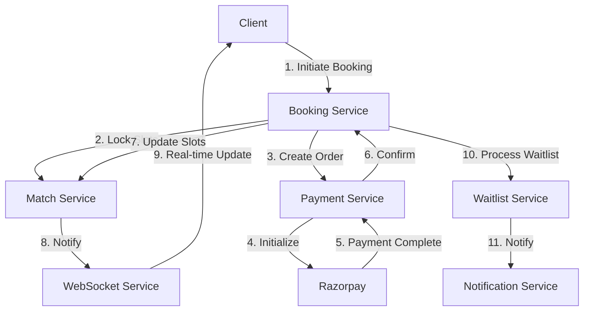
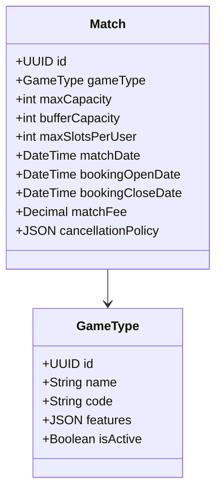
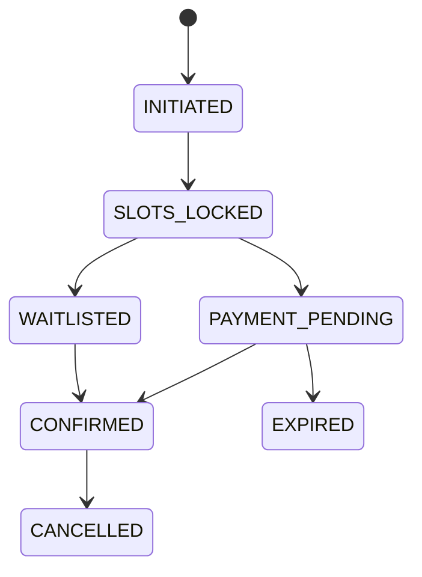
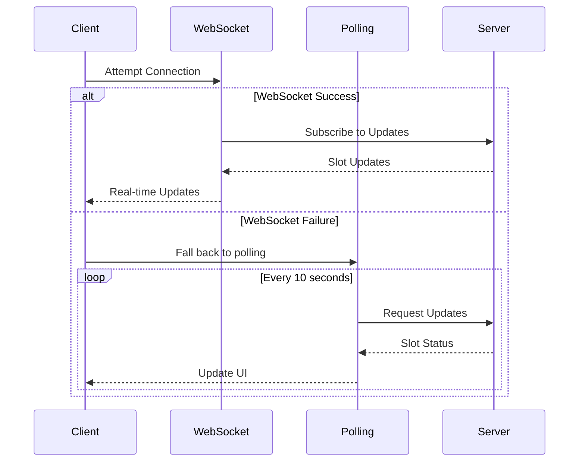
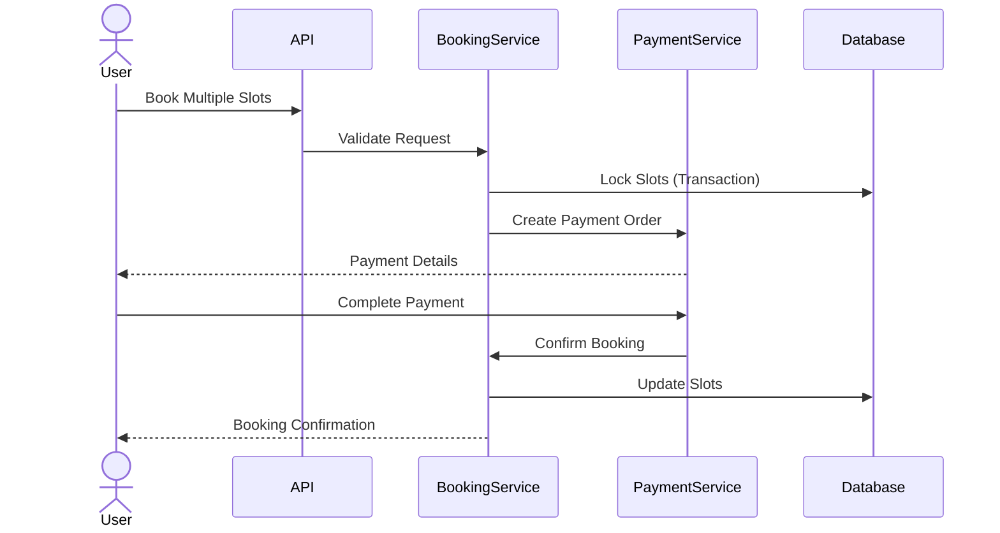
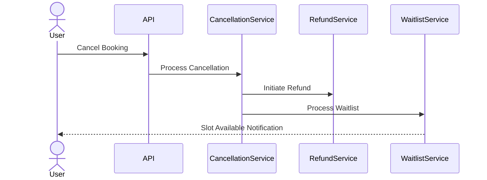

# Match Booking System Design

## Table of Contents
1. [System Overview](#system-overview)
2. [Core Components](#core-components)
3. [Key Flows](#key-flows)
4. [Technical Implementation](#technical-implementation)
5. [Error Handling](#error-handling)
6. [Scalability Considerations](#scalability-considerations)

## System Overview

The Match Booking System is designed to handle concurrent bookings for sports matches with the following key features:
- Multiple game types with different pricing
- Group booking support
- Waitlist management
- Real-time slot availability updates
- Payment integration with Razorpay
- Cancellation and refund handling

### Architecture Diagram



## Core Components

### 1. Match Configuration

Matches are configured with:
- Base capacity (e.g., 14 players for 7v7)
- Waitlist capacity (configurable)
- Game type (Regular, Limited Stats, Full Stats)
- Booking window
- Pricing



### 2. Booking Flow

The booking process follows a state machine pattern:



### 3. Real-time Updates

Real-time slot availability is managed through WebSocket connections with a polling fallback:



## Key Flows

### 1. Group Booking Process



### 2. Cancellation and Refund Flow



## Technical Implementation

### 1. Idempotency Handling

All booking operations are idempotent using unique request identifiers:

```typescript
interface BookingRequest {
    idempotencyKey: string;  // UUID generated on client
    matchId: string;
    numberOfSlots: number;
    playerDetails: PlayerDetail[];
    promoCode?: string;
}
```

### 2. Timeout Management

Bookings have a strict timeout policy:
- Payment completion window: 3 minutes
- Automatic slot release on timeout
- Waitlist processing on slot release

### 3. Concurrent Access Control

Database-level locking prevents double bookings:
- Row-level locks on match slots
- Optimistic locking for concurrent updates
- Transaction isolation for atomic operations

## Error Handling

1. **Payment Failures**
   - Automatic slot release
   - User notification
   - Retry mechanism for webhook failures

2. **Booking Conflicts**
   - Graceful degradation
   - Clear error messages
   - Alternative slot suggestions

3. **System Failures**
   - Transaction rollback
   - Automatic recovery
   - Monitoring and alerts

## Scalability Considerations

1. **Database**
   - Partitioned tables for bookings
   - Indexed queries for performance
   - Regular archival of old data

2. **Real-time Updates**
   - WebSocket connection pooling
   - Fallback to polling
   - Message queue for notifications

3. **Monitoring**
   - Transaction success rate
   - Payment completion time
   - Slot utilization metrics
   - Error rate tracking

## Configuration Guidelines

### Match Types
```json
{
  "REGULAR": {
    "features": {
      "stats": false,
      "highlights": false
    }
  },
  "LIMITED_STATS": {
    "features": {
      "stats": {
        "enabled": true,
        "count": 10
      },
      "highlights": {
        "enabled": true,
        "duration": 120
      }
    }
  },
  "FULL_STATS": {
    "features": {
      "stats": {
        "enabled": true,
        "unlimited": true
      },
      "highlights": {
        "enabled": true,
        "unlimited": true
      }
    }
  }
}
```

### Cancellation Rules
```json
{
  "fullRefundHours": 6,
  "partialRefund": false,
  "groupCancellation": {
    "allowPartial": false,
    "processingOrder": "all-or-nothing"
  }
}
```

## API Endpoints

Detailed API documentation is available in the [API_ENDPOINTS.md](./API_ENDPOINTS.md) file.

## Critical Edge Cases and Solutions

### Booking Process

**Q1: What happens if a user's payment succeeds but the server fails to receive the webhook?**
- Solution: 
  - Implement a payment reconciliation job that runs every 5 minutes
  - Query Razorpay API for pending payment statuses
  - Match with our booking records and update accordingly
  - Send confirmation notifications after reconciliation
  - Mark slots as confirmed if payment is found successful

**Q2: How to handle scenarios where multiple users try to book the last available slot simultaneously?**
- Solution:
  - Implement pessimistic locking at database level
  - First request to acquire lock gets priority
  - Other requests receive clear "Slot no longer available" message
  - Suggest waitlist option to users who couldn't get the slot
  - Cache slot status with very short TTL (1-2 seconds) to handle traffic spikes

**Q3: What if a user's connection drops during the payment process?**
- Solution:
  - Implement 3-minute timeout for payment completion
  - Provide booking reference for payment resume
  - Allow payment retry within timeout window
  - Auto-release slots after timeout
  - Send notification about incomplete transaction
  - Store partial booking data for analytics

### Group Bookings

**Q4: How to handle partial payment success in group bookings?**
- Solution:
  - Use atomic transactions for group bookings
  - Only confirm booking if full payment succeeds
  - Implement automatic refund for partial payments
  - Keep slots locked during refund process
  - Send detailed notification about failed group booking

**Q5: What happens if one player in a group booking needs to cancel?**
- Solution:
  - Enforce all-or-nothing cancellation policy
  - Provide clear UI indication about group cancellation rules
  - Allow booking owner to cancel entire group only
  - Process refund based on cancellation window
  - Notify all group members about cancellation

### Waitlist Management

**Q6: How to handle race conditions in waitlist promotions?**
- Solution:
  - Implement queue-based waitlist processing
  - Lock promoted slots for 15 minutes
  - Clear notification about promotion expiry time
  - Auto-skip to next in waitlist after timeout
  - Track promotion acceptance rate for analytics

**Q7: What if a waitlisted user gets promoted but doesn't complete payment?**
- Solution:
  - Set 15-minute timeout for promoted bookings
  - Send reminder notifications at 5 and 10 minutes
  - Auto-release slot if payment not completed
  - Move user to end of waitlist if they miss the window
  - Notify next waitlisted user immediately

### Payment and Refunds

**Q8: How to handle payment gateway downtime?**
- Solution:
  - Implement circuit breaker pattern
  - Show clear message about temporary unavailability
  - Queue booking requests if downtime is short
  - Provide estimated recovery time if available
  - Auto-retry queued bookings when system is back

**Q9: What if a refund fails due to payment gateway issues?**
- Solution:
  - Implement refund retry mechanism
  - Queue failed refunds for retry
  - Manual intervention trigger after 3 failed attempts
  - Keep user informed about refund status
  - Store all refund attempts for audit

### Concurrency and State Management

**Q10: How to maintain consistency in slot counts during high concurrency?**
- Solution:
  - Use database transactions with proper isolation level
  - Implement version-based concurrency control
  - Regular reconciliation of slot counts
  - Alert on slot count mismatches
  - Automated recovery process for inconsistencies

**Q11: What if the match details are updated after some bookings are made?**
- Solution:
  - Prevent critical match detail updates after first booking
  - Allow only non-critical updates (e.g., description)
  - Version match details for audit
  - Notify booked users about any allowed changes
  - Store original match details with booking

### System Failures

**Q12: How to handle database failures during booking process?**
- Solution:
  - Implement retry mechanism with exponential backoff
  - Roll back incomplete transactions
  - Clear error communication to user
  - Auto-release locked resources
  - Log all failures for investigation

**Q13: What if the notification service fails?**
- Solution:
  - Queue notifications with retry mechanism
  - Multiple notification channels (email, push, in-app)
  - Track delivery status for each channel
  - Fall back to alternative channels
  - Manual notification trigger capability

### User Experience

**Q14: How to handle browser back button during booking process?**
- Solution:
  - Implement booking session management
  - Clear warning about losing progress
  - Allow resume booking if within timeout
  - Store booking progress in session
  - Clear abandoned booking data

**Q15: What if user's device time is incorrect affecting booking windows?**
- Solution:
  - Use server time for all booking operations
  - Show countdown based on server time
  - Sync client time with server periodically
  - Clear indication of booking window times
  - Handle timezone differences explicitly

### Monitoring and Recovery

**Q16: How to detect and handle stuck bookings?**
- Solution:
  - Regular health check for active bookings
  - Timeout-based cleanup job
  - Alert on bookings stuck in intermediate states
  - Automated recovery for known scenarios
  - Manual intervention trigger for complex cases

**Q17: How to handle data inconsistencies found during audits?**
- Solution:
  - Regular reconciliation jobs
  - Automated fixing for known patterns
  - Alert on unexpected inconsistencies
  - Maintain audit trail of corrections
  - Prevention mechanisms for common causes

### Security

**Q18: How to prevent booking spam attacks?**
- Solution:
  - Rate limiting per user/IP
  - Captcha for suspicious patterns
  - Block suspicious payment patterns
  - Monitor booking velocity
  - Alert on unusual booking patterns

**Q19: How to handle payment fraud attempts?**
- Solution:
  - Implement Razorpay fraud detection
  - Track payment patterns per user
  - Block suspicious payment methods
  - Manual review trigger for suspicious cases
  - Maintain blacklist of fraudulent users

### Data Management

**Q20: How to handle booking data archival without losing reference?**
- Solution:
  - Implement soft delete for bookings
  - Archive data after defined period
  - Maintain minimal reference data
  - Retrievable archive process
  - Clear archive policy documentation
