# Match Booking System Design

## Table of Contents
1. [System Overview](#system-overview)
2. [Core Components](#core-components)
3. [Key Flows](#key-flows)
4. [Technical Implementation](#technical-implementation)
5. [Error Handling](#error-handling)
6. [Scalability Considerations](#scalability-considerations)

## System Overview

The Match Booking System is designed to handle concurrent bookings for sports matches with the following key features:
- Multiple game types with different pricing
- Group booking support with individual player details
- Waitlist management (non-sequential)
- Real-time slot availability updates
- Payment integration with Razorpay
- Cancellation and refund handling
- User creation for additional slot players

### Architecture Diagram

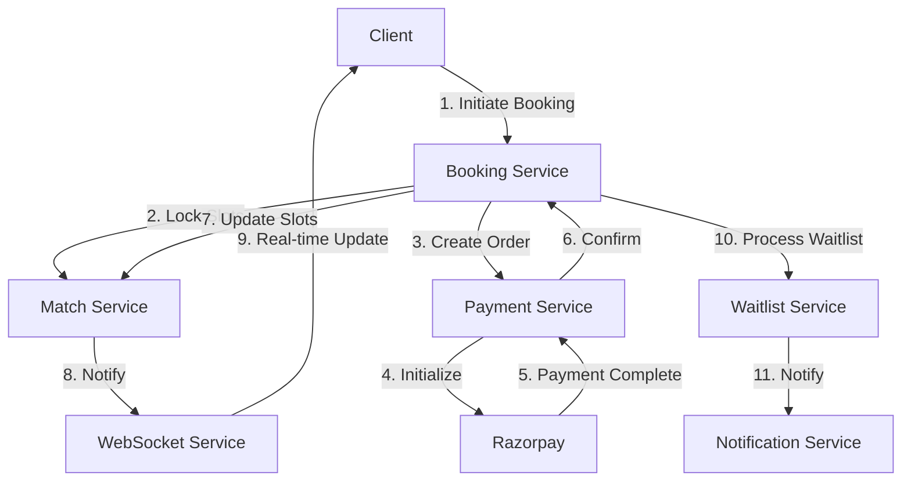

## User Flows

### 1. Complete Booking Flow with Database States

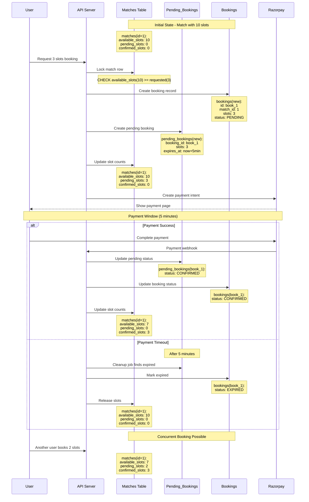

### 2. Cancellation Flow with Database States

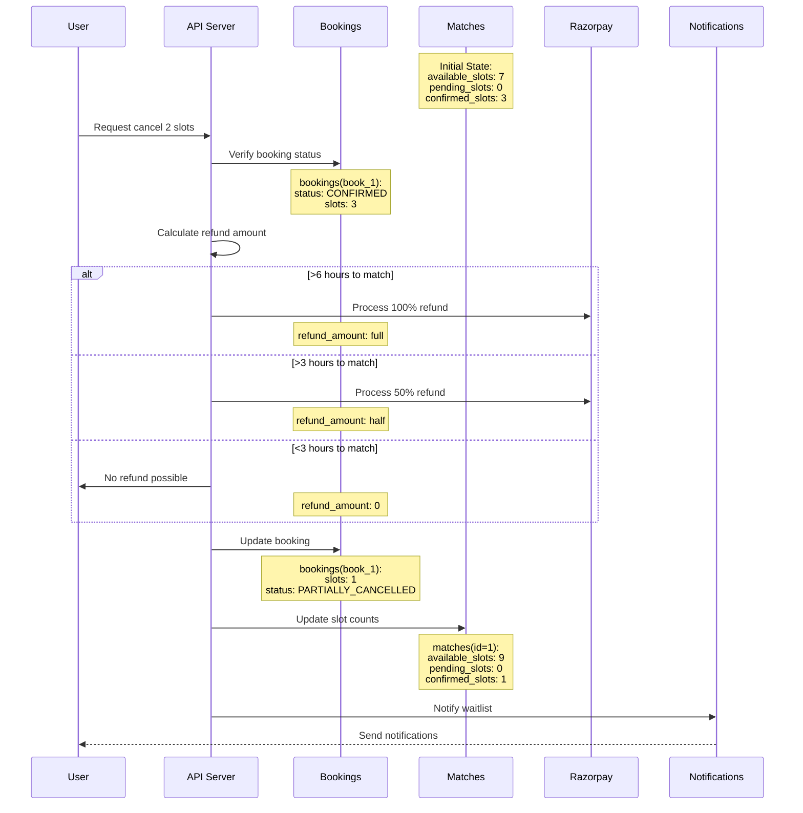

### 3. Match Booking Flow

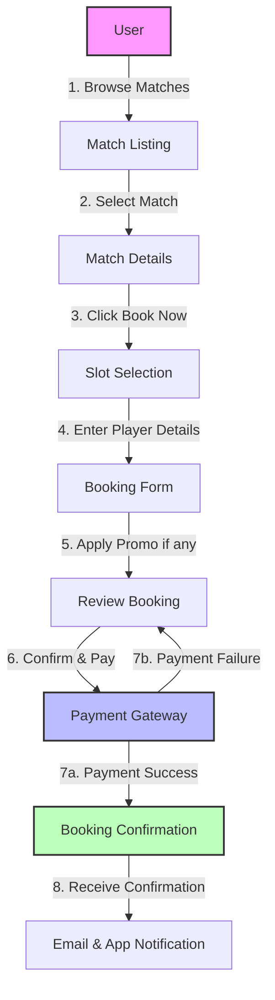

### 2. Booking History and Cancellation Flow

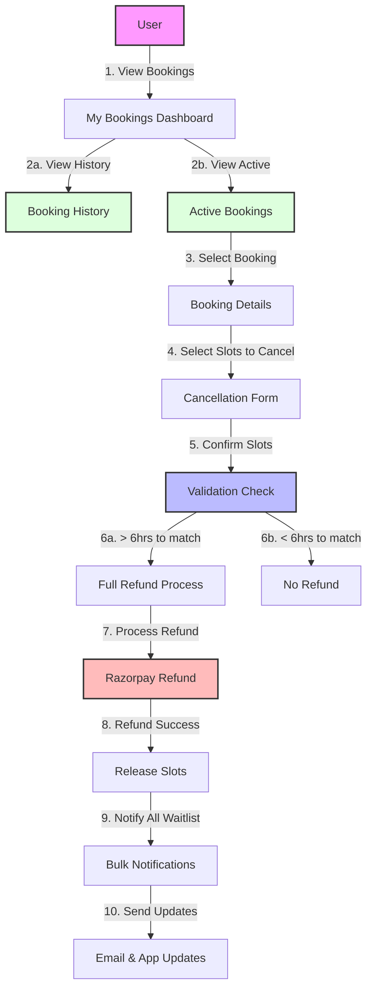

### 3. Coupon System Design

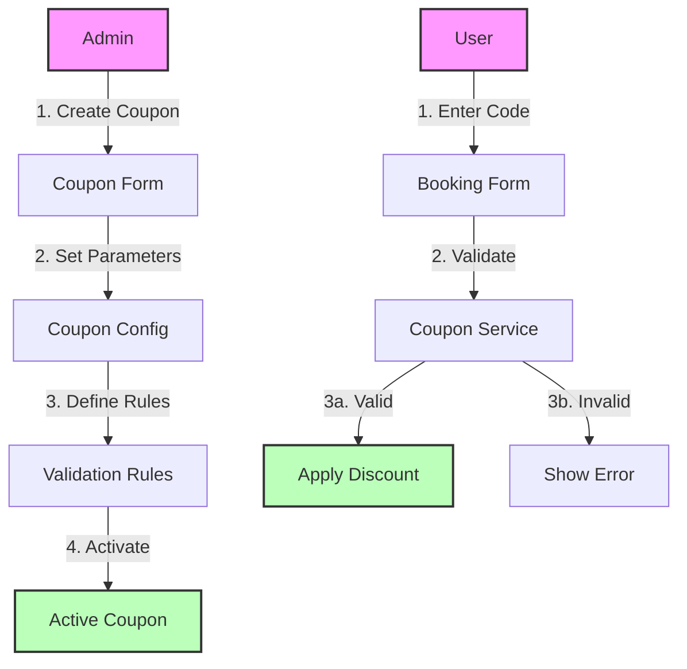

### 3. Database Schema Design

```sql
-- Core booking tables
CREATE TABLE bookings (
    id UUID PRIMARY KEY,
    booking_reference VARCHAR(50) UNIQUE,
    match_id UUID REFERENCES matches(id),
    user_id UUID REFERENCES users(id),
    booking_status VARCHAR(20) NOT NULL,
    total_slots INTEGER NOT NULL,
    total_amount DECIMAL(10,2) NOT NULL,
    payment_id VARCHAR(100),
    payment_status VARCHAR(20),
    promo_code_id UUID REFERENCES promo_codes(id),
    discount_amount DECIMAL(10,2),
    created_at TIMESTAMP DEFAULT CURRENT_TIMESTAMP,
    updated_at TIMESTAMP,
    cancelled_at TIMESTAMP,
    cancellation_reason TEXT,
    refund_status VARCHAR(20),
    refund_amount DECIMAL(10,2),
    metadata JSONB,
    CONSTRAINT valid_slots CHECK (total_slots > 0)
);

-- Individual slot tracking
CREATE TABLE booking_slots (
    id UUID PRIMARY KEY,
    booking_id UUID REFERENCES bookings(id),
    slot_number INTEGER NOT NULL,
    player_name VARCHAR(100),
    player_email VARCHAR(255),
    player_phone VARCHAR(20),
    status VARCHAR(20) NOT NULL,
    created_at TIMESTAMP DEFAULT CURRENT_TIMESTAMP,
    updated_at TIMESTAMP,
    UNIQUE(booking_id, slot_number)
);

-- Waitlist management (Updated for non-sequential waitlist)
CREATE TABLE waitlist_entries (
    id UUID PRIMARY KEY,
    match_id UUID REFERENCES matches(id),
    booking_id UUID REFERENCES bookings(id),
    user_id UUID REFERENCES users(id),
    slots_requested INTEGER NOT NULL,
    status VARCHAR(20) NOT NULL,
    created_at TIMESTAMP DEFAULT CURRENT_TIMESTAMP,
    notified_at TIMESTAMP,
    notification_count INTEGER DEFAULT 0,
    CONSTRAINT valid_waitlist_slots CHECK (slots_requested > 0)
);

-- Payment tracking
CREATE TABLE payment_transactions (
    id UUID PRIMARY KEY,
    booking_id UUID REFERENCES bookings(id),
    amount DECIMAL(10,2) NOT NULL,
    currency VARCHAR(3) DEFAULT 'INR',
    razorpay_order_id VARCHAR(100),
    razorpay_payment_id VARCHAR(100),
    status VARCHAR(20) NOT NULL,
    created_at TIMESTAMP DEFAULT CURRENT_TIMESTAMP,
    updated_at TIMESTAMP,
    metadata JSONB
);

-- Refund tracking
CREATE TABLE refund_transactions (
    id UUID PRIMARY KEY,
    booking_id UUID REFERENCES bookings(id),
    payment_transaction_id UUID REFERENCES payment_transactions(id),
    amount DECIMAL(10,2) NOT NULL,
    razorpay_refund_id VARCHAR(100),
    status VARCHAR(20) NOT NULL,
    reason TEXT,
    created_at TIMESTAMP DEFAULT CURRENT_TIMESTAMP,
    updated_at TIMESTAMP,
    metadata JSONB
);

-- Coupon management
CREATE TABLE coupons (
    id UUID PRIMARY KEY,
    code VARCHAR(50) UNIQUE NOT NULL,
    description TEXT,
    discount_type VARCHAR(20) NOT NULL, -- 'PERCENTAGE' or 'FIXED'
    discount_value DECIMAL(10,2) NOT NULL,
    min_booking_amount DECIMAL(10,2),
    max_discount_amount DECIMAL(10,2),
    max_uses_per_user INTEGER,
    total_max_uses INTEGER,
    valid_from TIMESTAMP NOT NULL,
    valid_until TIMESTAMP,
    is_active BOOLEAN DEFAULT true,
    created_at TIMESTAMP DEFAULT CURRENT_TIMESTAMP,
    created_by UUID REFERENCES users(id),
    updated_at TIMESTAMP,
    CONSTRAINT valid_discount CHECK (
        (discount_type = 'PERCENTAGE' AND discount_value <= 100) OR
        (discount_type = 'FIXED' AND discount_value > 0)
    )
);

-- Coupon usage tracking
CREATE TABLE coupon_usage (
    id UUID PRIMARY KEY,
    coupon_id UUID REFERENCES coupons(id),
    user_id UUID REFERENCES users(id),
    booking_id UUID REFERENCES bookings(id),
    discount_amount DECIMAL(10,2) NOT NULL,
    used_at TIMESTAMP DEFAULT CURRENT_TIMESTAMP,
    UNIQUE(coupon_id, booking_id)
);

-- Audit trail for all booking-related actions
CREATE TABLE booking_audit_logs (
    id UUID PRIMARY KEY,
    booking_id UUID REFERENCES bookings(id),
    action VARCHAR(50) NOT NULL,
    actor_id UUID REFERENCES users(id),
    old_state JSONB,
    new_state JSONB,
    created_at TIMESTAMP DEFAULT CURRENT_TIMESTAMP,
    metadata JSONB
);
```

Key Features of the Schema:
1. **Booking Status Tracking**: Complete state management through status fields
2. **Slot Management**: Individual tracking of each slot in a booking
3. **Payment Integration**: Comprehensive payment and refund tracking
4. **Waitlist Handling**: Non-sequential waitlist with notification tracking
5. **Audit Trail**: Complete history of all booking-related actions
6. **Metadata Support**: JSONB fields for flexible additional data storage
7. **Referential Integrity**: Foreign key constraints for data consistency
8. **Constraints**: Business rules enforced at database level
9. **Coupon System**: Flexible discount management with usage tracking
10. **Partial Cancellation**: Support for cancelling individual slots

### Implementation Details

#### 1. Partial Slot Cancellation System

The partial cancellation system allows users to cancel specific slots from their group booking. Here's how it works:

##### A. User Flow for Partial Cancellation
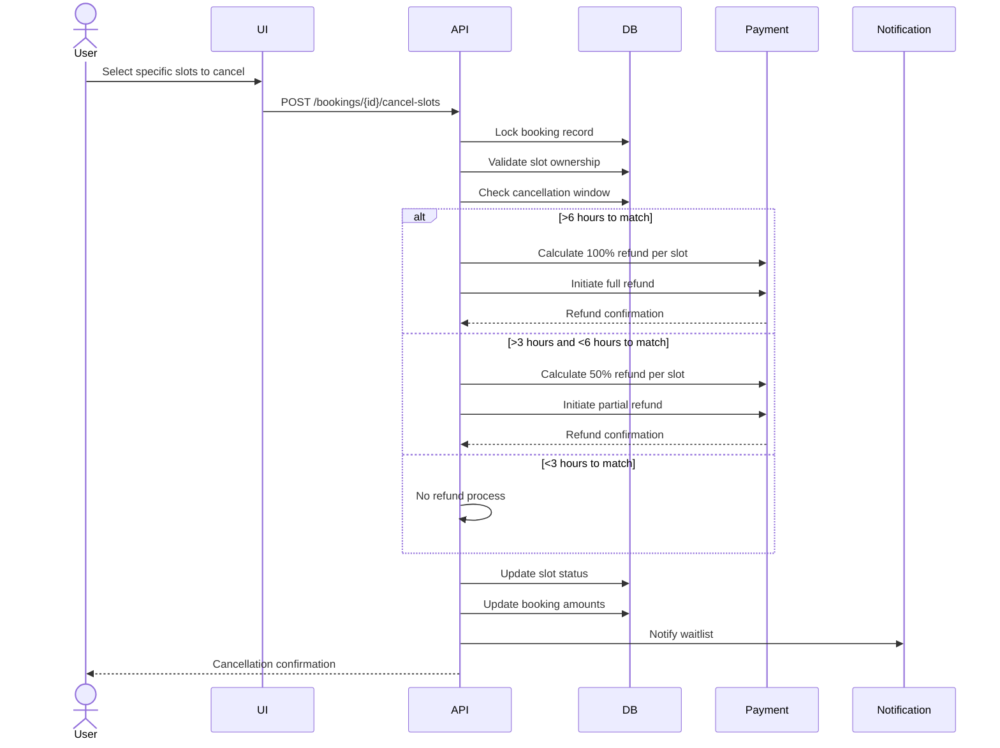

##### B. Database State Changes
```sql
-- Example of a booking with 3 slots where 1 is being cancelled
-- Initial State
booking_slots
id  | booking_id | slot_number | status    | player_name
1   | book_123   | 1          | CONFIRMED | Player 1
2   | book_123   | 2          | CONFIRMED | Player 2
3   | book_123   | 3          | CONFIRMED | Player 3

-- After cancelling slot 2
booking_slots
id  | booking_id | slot_number | status    | player_name
1   | book_123   | 1          | CONFIRMED | Player 1
2   | book_123   | 2          | CANCELLED | Player 2
3   | book_123   | 3          | CONFIRMED | Player 3
```

##### C. Refund Calculation for Partial Cancellation

1. **Example Refund Scenarios**
```
Original Booking: 3 slots for ₹900 (₹300 per slot)
Applied Coupon: 10% off (₹90 discount, ₹30 per slot)

Scenario 1: Cancelling 1 slot >6 hours before match
- Base amount: ₹300
- Refund percentage: 100%
- Refund before discount adjustment: ₹300
- Discount adjustment: ₹30 (full discount returned)
- Final refund: ₹270

Scenario 2: Cancelling 1 slot 4 hours before match
- Base amount: ₹300
- Refund percentage: 50%
- Refund before discount adjustment: ₹150
- Discount adjustment: ₹15 (50% of discount returned)
- Final refund: ₹135

Scenario 3: Cancelling 1 slot 2 hours before match
- Base amount: ₹300
- Refund percentage: 0%
- Final refund: ₹0 (no refund)
```

2. **Basic Refund Calculation**
```typescript
interface RefundCalculator {
    calculatePartialRefund(
        booking: Booking,
        cancelledSlots: number,
        match: Match
    ): number {
        // Get per slot amount
        const perSlotAmount = booking.total_amount / booking.total_slots;
        
        // Calculate base refund before time-based rules
        const baseRefund = perSlotAmount * cancelledSlots;

        // Calculate hours until match
        const hoursUntilMatch = differenceInHours(
            match.start_time,
            new Date()
        );

        // Apply time-based refund rules
        let refundPercentage = 0;
        if (hoursUntilMatch > 6) {
            refundPercentage = 100; // Full refund
        } else if (hoursUntilMatch > 3) {
            refundPercentage = 50;  // 50% refund
        } // else 0% refund

        const timeBasedRefund = (baseRefund * refundPercentage) / 100;

        // If coupon was applied, adjust refund proportionally
        if (booking.discount_amount && refundPercentage > 0) {
            const discountPerSlot = booking.discount_amount / booking.total_slots;
            const discountAdjustment = (discountPerSlot * cancelledSlots * refundPercentage) / 100;
            return timeBasedRefund - discountAdjustment;
        }

        return timeBasedRefund;
    }

    // Helper method to determine refund percentage
    getRefundPercentage(hoursUntilMatch: number): number {
        if (hoursUntilMatch > 6) return 100;
        if (hoursUntilMatch > 3) return 50;
        return 0;
    }

    // Example usage with detailed breakdown
    async getRefundBreakdown(
        booking: Booking,
        cancelledSlots: number,
        match: Match
    ): Promise<RefundBreakdown> {
        const perSlotAmount = booking.total_amount / booking.total_slots;
        const baseAmount = perSlotAmount * cancelledSlots;
        const hoursUntilMatch = differenceInHours(match.start_time, new Date());
        const refundPercentage = this.getRefundPercentage(hoursUntilMatch);
        
        return {
            originalAmount: baseAmount,
            refundPercentage,
            refundAmount: (baseAmount * refundPercentage) / 100,
            discountAdjustment: booking.discount_amount 
                ? (booking.discount_amount / booking.total_slots * cancelledSlots * refundPercentage) / 100
                : 0,
            timeWindow: hoursUntilMatch > 6 
                ? 'FULL_REFUND' 
                : hoursUntilMatch > 3 
                    ? 'PARTIAL_REFUND' 
                    : 'NO_REFUND'
        };
    }
}
```

2. **State Management**
```typescript
enum SlotStatus {
    CONFIRMED = 'CONFIRMED',
    CANCELLED = 'CANCELLED',
    REFUNDED = 'REFUNDED',
    REFUND_PENDING = 'REFUND_PENDING'
}

interface BookingStateManager {
    async updateBookingState(
        booking: Booking,
        cancelledSlots: string[],
        trx: Transaction
    ): Promise<void> {
        // 1. Update individual slot statuses
        await this.slotRepo.updateMany(
            cancelledSlots,
            { status: SlotStatus.CANCELLED },
            trx
        );

        // 2. Calculate new booking totals
        const remainingSlots = booking.total_slots - cancelledSlots.length;
        const newAmount = this.calculateRemainingAmount(booking, cancelledSlots.length);

        // 3. Update main booking record
        await this.bookingRepo.update(
            booking.id,
            {
                total_slots: remainingSlots,
                total_amount: newAmount,
                updated_at: new Date(),
                status: remainingSlots === 0 ? 'FULLY_CANCELLED' : 'PARTIALLY_CANCELLED'
            },
            trx
        );
    }
}
```

##### D. Implementation Details for Partial Cancellation
```typescript
interface PartialCancellationService {
    async cancelSelectedSlots(
        bookingId: string, 
        slotIds: string[]
    ): Promise<CancellationResult> {
        return await db.transaction(async (trx) => {
            // 1. Validate cancellation eligibility
            const booking = await this.validatePartialCancellation(
                bookingId, 
                slotIds, 
                trx
            );

            // 2. Calculate refund amount per slot
            const refundAmount = await this.calculatePartialRefund(
                booking,
                slotIds.length
            );

            // 3. Process partial cancellation
            const cancellation = await this.processPartialCancellation(
                booking,
                slotIds,
                refundAmount,
                trx
            );

            // 4. Release cancelled slots
            await this.releaseSpecificSlots(booking.match_id, slotIds, trx);

            // 5. Notify all waitlisted users
            await this.notifyWaitlistedUsers(booking.match_id, slotIds.length);

            return cancellation;
        });
    }

    private async validatePartialCancellation(
        bookingId: string,
        slotIds: string[],
        trx: Transaction
    ): Promise<Booking> {
        const booking = await this.bookingRepo.findWithLock(bookingId, trx);
        
        // Ensure all slots belong to this booking
        const slots = await this.slotRepo.findByIds(slotIds, trx);
        if (slots.some(slot => slot.booking_id !== bookingId)) {
            throw new InvalidSlotSelectionError();
        }

        // Check cancellation window
        const match = await this.matchRepo.findById(booking.match_id);
        const hoursUntilMatch = differenceInHours(
            match.start_time, 
            new Date()
        );
        
        return booking;
    }
}

#### 2. Waitlist Notification System
```typescript
interface WaitlistNotificationService {
    async notifyAllWaitlistedUsers(
        matchId: string,
        availableSlots: number
    ): Promise<void> {
        // 1. Get all waitlisted entries for the match
        const waitlistEntries = await this.waitlistRepo.findByMatch(matchId);

        // 2. Send notifications in parallel
        await Promise.all(
            waitlistEntries.map(entry => 
                this.sendAvailabilityNotification(entry, availableSlots)
            )
        );

        // 3. Update notification tracking
        await this.waitlistRepo.updateNotificationStatus(
            waitlistEntries.map(e => e.id)
        );
    }

    private async sendAvailabilityNotification(
        entry: WaitlistEntry,
        availableSlots: number
    ): Promise<void> {
        // Send both email and push notification
        await Promise.all([
            this.emailService.sendSlotAvailableEmail({
                userId: entry.user_id,
                matchId: entry.match_id,
                availableSlots,
                bookingLink: this.generateBookingLink(entry)
            }),
            this.pushNotificationService.sendNotification({
                userId: entry.user_id,
                title: 'Slots Available!',
                body: `${availableSlots} slots are now available for your waitlisted match`,
                data: {
                    matchId: entry.match_id,
                    action: 'BOOK_SLOT'
                }
            })
        ]);
    }
}

#### 3. Coupon Validation Service
```typescript
interface CouponService {
    async validateAndApplyCoupon(
        code: string,
        userId: string,
        bookingAmount: number
    ): Promise<DiscountResult> {
        const coupon = await this.couponRepo.findByCode(code);
        
        // 1. Basic validation
        if (!coupon || !coupon.is_active) {
            throw new InvalidCouponError();
        }

        // 2. Check validity period
        if (!this.isWithinValidityPeriod(coupon)) {
            throw new ExpiredCouponError();
        }

        // 3. Check usage limits
        await this.validateUsageLimits(coupon, userId);

        // 4. Calculate discount
        const discount = this.calculateDiscount(
            coupon,
            bookingAmount
        );

        return {
            discountAmount: discount,
            finalAmount: bookingAmount - discount
        };
    }

    private async validateUsageLimits(
        coupon: Coupon,
        userId: string
    ): Promise<void> {
        // Check total usage
        if (coupon.total_max_uses) {
            const totalUses = await this.couponUsageRepo.getTotalUses(
                coupon.id
            );
            if (totalUses >= coupon.total_max_uses) {
                throw new CouponExhaustedError();
            }
        }

        // Check per-user usage
        if (coupon.max_uses_per_user) {
            const userUses = await this.couponUsageRepo.getUserUses(
                coupon.id,
                userId
            );
            if (userUses >= coupon.max_uses_per_user) {
                throw new UserCouponLimitError();
            }
        }
    }
}

## Core Components

### 1. Match Configuration

Matches are configured with:
- **Player Capacity**: Base slots (e.g., 14 for 7v7)
- **Buffer Capacity**: Waitlist slots (e.g., 4 additional)
- **Total Capacity**: Player Capacity + Buffer Capacity
- Game type (Regular, Limited Stats, Full Stats)
- Booking window
- Pricing

### Slot Management Logic

1. **Regular Slots**: `playerCapacity - bookedSlots - lockedSlots`
2. **Waitlist Slots**: `bufferCapacity` (only when regular slots are full)
3. **Booking Types**: 
   - Regular: Direct booking to confirmed slots
   - Waitlist: Booking to buffer slots (no charge until confirmed)

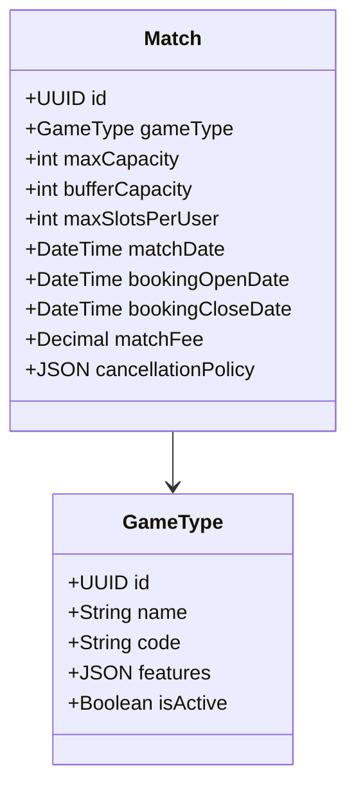

### 2. Booking Flow

The booking process follows a state machine pattern:

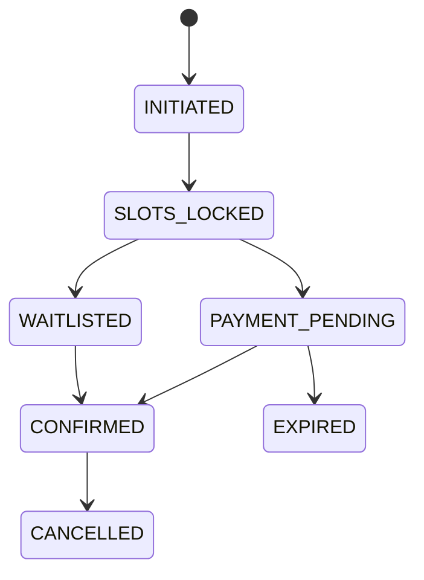

### 3. Real-time Updates

Real-time slot availability is managed through WebSocket connections with a polling fallback:

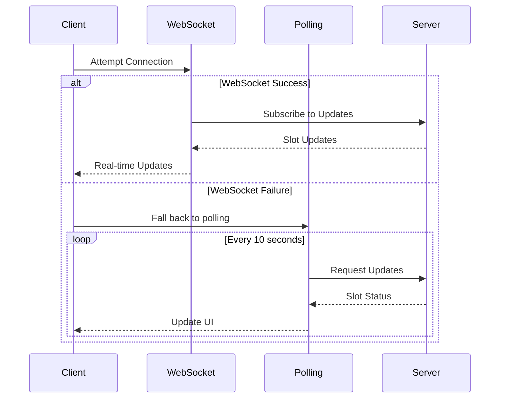

## Key Flows

### 1. Group Booking Process

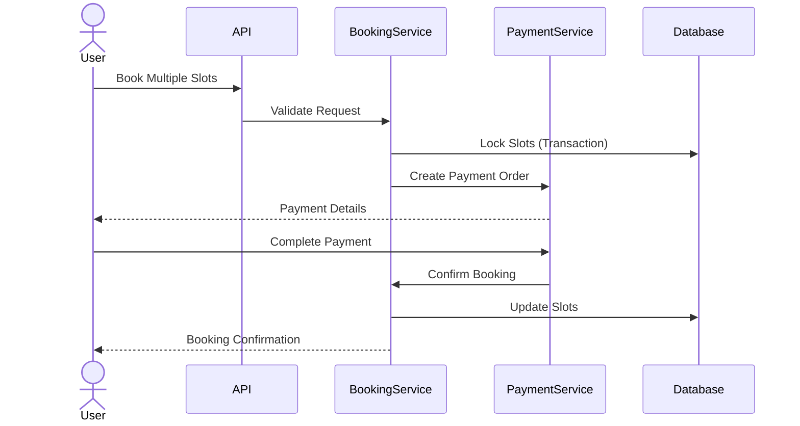

### 2. Cancellation and Refund Flow

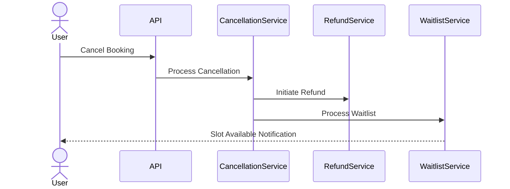

## Technical Implementation

### 1. Idempotency Handling

All booking operations are idempotent using unique request identifiers:

```typescript
interface BookingRequest {
    idempotencyKey: string;  // UUID generated on client
    matchId: string;
    numberOfSlots: number;
    playerDetails: PlayerDetail[];
    promoCode?: string;
}
```

### 2. Timeout Management

Bookings have a strict timeout policy:
- Payment completion window: 3 minutes
- Automatic slot release on timeout
- Waitlist processing on slot release

### 3. Concurrent Access Control

Database-level locking prevents double bookings:
- Row-level locks on match slots
- Optimistic locking for concurrent updates
- Transaction isolation for atomic operations

## Error Handling

1. **Payment Failures**
   - Automatic slot release
   - User notification
   - Retry mechanism for webhook failures

2. **Booking Conflicts**
   - Graceful degradation
   - Clear error messages
   - Alternative slot suggestions

3. **System Failures**
   - Transaction rollback
   - Automatic recovery
   - Monitoring and alerts

## Scalability Considerations

1. **Database**
   - Partitioned tables for bookings
   - Indexed queries for performance
   - Regular archival of old data

2. **Real-time Updates**
   - WebSocket connection pooling
   - Fallback to polling
   - Message queue for notifications

3. **Monitoring**
   - Transaction success rate
   - Payment completion time
   - Slot utilization metrics
   - Error rate tracking

## Configuration Guidelines

### Match Types
```json
{
  "REGULAR": {
    "features": {
      "stats": false,
      "highlights": false
    }
  },
  "LIMITED_STATS": {
    "features": {
      "stats": {
        "enabled": true,
        "count": 10
      },
      "highlights": {
        "enabled": true,
        "duration": 120
      }
    }
  },
  "FULL_STATS": {
    "features": {
      "stats": {
        "enabled": true,
        "unlimited": true
      },
      "highlights": {
        "enabled": true,
        "unlimited": true
      }
    }
  }
}
```

### Cancellation Rules
```json
{
  "fullRefundHours": 6,
  "partialRefund": false,
  "groupCancellation": {
    "allowPartial": false,
    "processingOrder": "all-or-nothing"
  }
}
```

## API Endpoints

Detailed API documentation is available in the [API_ENDPOINTS.md](./API_ENDPOINTS.md) file.

## Critical Edge Cases and Solutions

### Booking Process

**Q1: What happens if a user's payment succeeds but the server fails to receive the webhook?**
- Solution: 
  - Implement a payment reconciliation job that runs every 5 minutes
  - Query Razorpay API for pending payment statuses
  - Match with our booking records and update accordingly
  - Send confirmation notifications after reconciliation
  - Mark slots as confirmed if payment is found successful

**Q2: How to handle scenarios where multiple users try to book the last available slot simultaneously?**
- Solution:
  - Implement pessimistic locking at database level
  - First request to acquire lock gets priority
  - Other requests receive clear "Slot no longer available" message
  - Suggest waitlist option to users who couldn't get the slot
  - Cache slot status with very short TTL (1-2 seconds) to handle traffic spikes

**Q3: What if a user's connection drops during the payment process?**
- Solution:
  - Implement 3-minute timeout for payment completion
  - Provide booking reference for payment resume
  - Allow payment retry within timeout window
  - Auto-release slots after timeout
  - Send notification about incomplete transaction
  - Store partial booking data for analytics

### Group Bookings

**Q4: How to handle partial payment success in group bookings?**
- Solution:
  - Use atomic transactions for group bookings
  - Only confirm booking if full payment succeeds
  - Implement automatic refund for partial payments
  - Keep slots locked during refund process
  - Send detailed notification about failed group booking

**Q5: What happens if one player in a group booking needs to cancel?**
- Solution:
  - Enforce all-or-nothing cancellation policy
  - Provide clear UI indication about group cancellation rules
  - Allow booking owner to cancel entire group only
  - Process refund based on cancellation window
  - Notify all group members about cancellation

### Waitlist Management

**Q6: How to handle race conditions in waitlist promotions?**
- Solution:
  - Implement queue-based waitlist processing
  - Lock promoted slots for 15 minutes
  - Clear notification about promotion expiry time
  - Auto-skip to next in waitlist after timeout
  - Track promotion acceptance rate for analytics

**Q7: What if a waitlisted user gets promoted but doesn't complete payment?**
- Solution:
  - Set 15-minute timeout for promoted bookings
  - Send reminder notifications at 5 and 10 minutes
  - Auto-release slot if payment not completed
  - Move user to end of waitlist if they miss the window
  - Notify next waitlisted user immediately

### Payment and Refunds

**Q8: How to handle payment gateway downtime?**
- Solution:
  - Implement circuit breaker pattern
  - Show clear message about temporary unavailability
  - Queue booking requests if downtime is short
  - Provide estimated recovery time if available
  - Auto-retry queued bookings when system is back

**Q9: What if a refund fails due to payment gateway issues?**
- Solution:
  - Implement refund retry mechanism
  - Queue failed refunds for retry
  - Manual intervention trigger after 3 failed attempts
  - Keep user informed about refund status
  - Store all refund attempts for audit

### Concurrency and State Management

**Q10: How to maintain consistency in slot counts during high concurrency?**
- Solution:
  - Use database transactions with proper isolation level
  - Implement version-based concurrency control
  - Regular reconciliation of slot counts
  - Alert on slot count mismatches
  - Automated recovery process for inconsistencies

**Q11: What if the match details are updated after some bookings are made?**
- Solution:
  - Prevent critical match detail updates after first booking
  - Allow only non-critical updates (e.g., description)
  - Version match details for audit
  - Notify booked users about any allowed changes
  - Store original match details with booking

### System Failures

**Q12: How to handle database failures during booking process?**
- Solution:
  - Implement retry mechanism with exponential backoff
  - Roll back incomplete transactions
  - Clear error communication to user
  - Auto-release locked resources
  - Log all failures for investigation

**Q13: What if the notification service fails?**
- Solution:
  - Queue notifications with retry mechanism
  - Multiple notification channels (email, push, in-app)
  - Track delivery status for each channel
  - Fall back to alternative channels
  - Manual notification trigger capability

### User Experience

**Q14: How to handle browser back button during booking process?**
- Solution:
  - Implement booking session management
  - Clear warning about losing progress
  - Allow resume booking if within timeout
  - Store booking progress in session
  - Clear abandoned booking data

**Q15: What if user's device time is incorrect affecting booking windows?**
- Solution:
  - Use server time for all booking operations
  - Show countdown based on server time
  - Sync client time with server periodically
  - Clear indication of booking window times
  - Handle timezone differences explicitly

### Monitoring and Recovery

**Q16: How to detect and handle stuck bookings?**
- Solution:
  - Regular health check for active bookings
  - Timeout-based cleanup job
  - Alert on bookings stuck in intermediate states
  - Automated recovery for known scenarios
  - Manual intervention trigger for complex cases

**Q17: How to handle data inconsistencies found during audits?**
- Solution:
  - Regular reconciliation jobs
  - Automated fixing for known patterns
  - Alert on unexpected inconsistencies
  - Maintain audit trail of corrections
  - Prevention mechanisms for common causes

### Security

**Q18: How to prevent booking spam attacks?**
- Solution:
  - Rate limiting per user/IP
  - Captcha for suspicious patterns
  - Block suspicious payment patterns
  - Monitor booking velocity
  - Alert on unusual booking patterns

**Q19: How to handle payment fraud attempts?**
- Solution:
  - Implement Razorpay fraud detection
  - Track payment patterns per user
  - Block suspicious payment methods
  - Manual review trigger for suspicious cases
  - Maintain blacklist of fraudulent users

### Data Management

**Q20: How to handle booking data archival without losing reference?**
- Solution:
  - Implement soft delete for bookings
  - Archive data after defined period
  - Maintain minimal reference data
  - Retrievable archive process
  - Clear archive policy documentation
